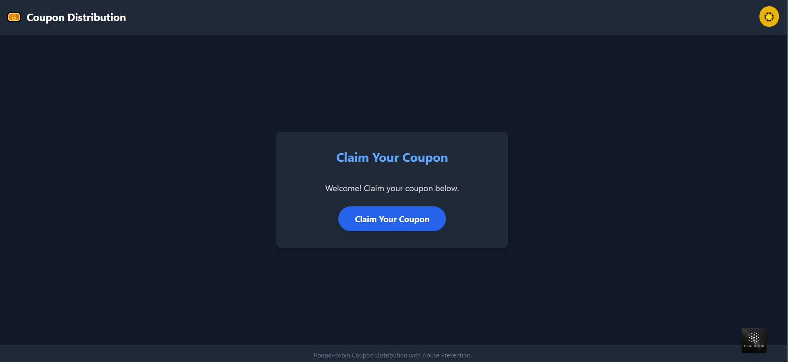

# Coupon Distribution Frontend

A React application that provides a user interface for claiming coupons using a round-robin distribution system with abuse prevention.



## Features

- Clean, responsive user interface with dark/light theme toggle
- Real-time feedback on coupon claims
- Visual countdown timer for cooldown periods
- Cross-browser compatible design
- Seamless integration with the backend API

## Live Demo

The application is deployed and can be accessed at:
[https://coupon-frontend-jet.vercel.app/](https://coupon-frontend-jet.vercel.app/)

## Tech Stack

- React.js
- Axios for API requests
- Tailwind CSS for styling
- Dynamic favicon implementation

## Setup Instructions

### Prerequisites

- Node.js (v14.0 or higher)
- npm or yarn

### Installation

1. Clone this repository:
   ```bash
   git clone https://github.com/Rishab2245/couponFrontend.git
   cd couponFrontend
   ```

2. Install dependencies:
   ```bash
   npm install
   # or
   yarn install
   ```

4. Start the development server:
   ```bash
   npm run dev
   # or
   yarn dev
   ```

5. Build for production:
   ```bash
   npm run build
   # or
   yarn build
   ```

## Integration with Backend

The frontend interacts with the backend through a RESTful API. The main integration point is the `/claim` endpoint, which handles the coupon distribution and abuse prevention logic.

### API Integration

The application uses Axios to make HTTP requests to the backend:

```javascript
const API_URL = 'https://couponbackend-n276.onrender.com/claim';

// Function to claim a coupon
const claimCoupon = async () => {
  try {
    const response = await axios.get(API_URL);
    
    if (response.data.success) {
      // Handle successful claim
      setUserCoupon(response.data.coupon);
    } else {
      // Handle errors or cooldown periods
      setMessage(response.data.message);
    }
  } catch (error) {
    // Handle network errors
    setMessage('Error claiming coupon. Please try again later.');
  }
};
```

## Abuse Prevention (Client-Side)

While the main abuse prevention logic is implemented on the server, the frontend provides several supporting features:

1. **UI Feedback**: Clear visual indication of cooldown periods to inform users they need to wait before claiming another coupon.

2. **Button Disabling**: The claim button is automatically disabled during cooldown periods to prevent repeated clicking.

3. **Error Handling**: Proper display of server-side validation errors, including remaining time until next claim is allowed.

4. **No Client-Side Storage**: The frontend does not store coupon information locally beyond the current session to discourage cheating.

## Deployment

### Building for Production

```bash
npm run build
# or
yarn build
```

This will create a `dist` directory with the compiled assets ready for deployment.

### Deploying to vercel.com

1. Create a new Web Project on vercel.com
2. Connect your GitHub repository
3. Set the build command: `npm run build`
4. Add environment variables as needed